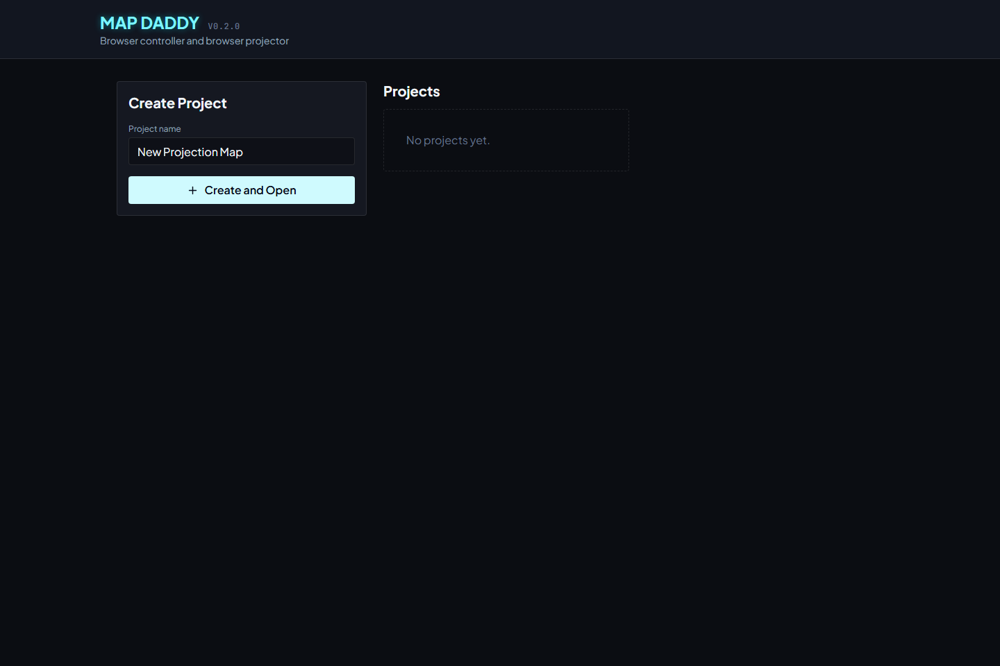
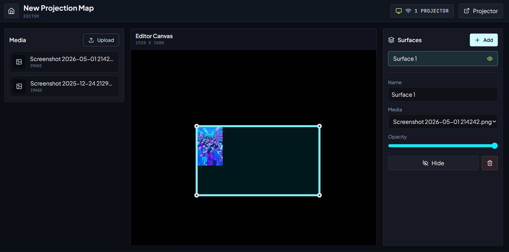
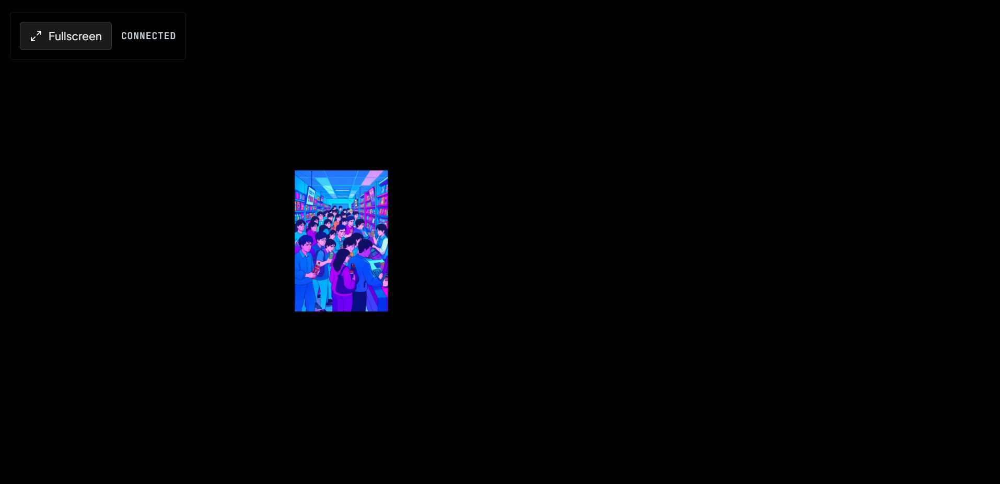

# Map Daddy

Map Daddy is an open-source, web-first projection mapping app. It lets you open a controller/editor in one browser window or device, open a projector output in another, and sync mapping changes live between them.

The current MVP focuses on images, quad surfaces, browser-to-browser realtime sync, and a clean project state model that can later be backed by hosted storage such as Cloudflare, Supabase, Firebase, or S3.

## Features

- Browser dashboard for creating and opening projects.
- Browser editor at `/editor/:projectId`.
- Browser projector output at `/projector/:projectId`.
- Live WebSocket sync from editor to one or more projector clients.
- Local project persistence through FastAPI, with localStorage fallback.
- Image uploads through the backend media API.
- Quad surface creation, corner dragging, and whole-surface dragging.
- Canvas renderer with lightweight quad warping.
- Cloudflare Worker support for hosted project API, media storage, and realtime rooms.
- Legacy Python receiver code remains available for Raspberry Pi and desktop receiver experiments.

## Screenshots

Dashboard project management:



Editor surface mapping:



Browser projector output:



## Architecture

```text
Browser Controller / Editor
  - edits project state
  - uploads/selects media
  - drags surface corners or whole surfaces
  - saves project state
  - sends live updates

FastAPI Backend
  - stores projects as JSON
  - serves uploaded media
  - can proxy relay session creation for legacy receiver flows

WebSocket Relay
  - hosts project rooms
  - broadcasts editor updates to projector clients
  - keeps the latest in-memory project state for reconnects

Browser Projector
  - render-only fullscreen output
  - loads latest saved project on open
  - receives live project updates
```

The relay sends JSON only. Media files are referenced by URL and fetched by the browser.

## Repository Layout

```text
frontend/          Vite + React browser dashboard, editor, and projector
backend/           FastAPI project/media API
relay/             Node WebSocket relay for live project rooms
cloudflare/worker/ Cloudflare Worker implementation for hosted API/realtime
renderer-pi/       Legacy Python receiver for Raspberry Pi/Desktop
renderer/          Older renderer prototype
shared/            Scene schema and examples
docs/              Architecture, setup, deployment, and release notes
```

## Quick Start

Use three terminals.

Backend:

```powershell
cd backend
python -m venv .venv
.\.venv\Scripts\Activate.ps1
python -m pip install -r requirements.txt
python main.py
```

Relay:

```powershell
cd relay
npm install
npm run dev
```

Frontend:

```powershell
cd frontend
npm install
npm run dev
```

Open:

```text
http://localhost:5173/dashboard
```

Create a project, add/upload media, add or select a surface, then copy or open the projector link in another tab or projector-connected device.

## Primary Product Flow

1. Start the backend, relay, and frontend.
2. Open the dashboard at `http://localhost:5173/dashboard`.
3. Create or open a project.
4. In the editor, click **Copy Projector Link** or **Projector**.
5. Open `/projector/:projectId` on the display connected to your projector.
6. Click **Fullscreen** on the projector page.
7. Edit from the browser editor and watch the projector page update live.

## Local Testing Checklist

- Start backend in terminal 1.
- Start relay in terminal 2.
- Start frontend in terminal 3.
- Open the editor in one browser tab.
- Open the projector page in another browser tab.
- Upload an image and create or select a surface.
- Drag a surface corner and verify the projector updates live.
- Drag the whole surface and verify the projector updates live.
- Refresh the projector page and verify the latest saved project loads.
- Open a second projector tab and verify both projector clients update.

## Local Environment

For local development, create `frontend/.env.local`:

```env
VITE_MAP_DADDY_API_URL=http://localhost:8000
VITE_MAP_DADDY_RELAY_URL=ws://localhost:8080
VITE_MAP_DADDY_PUBLIC_BACKEND_URL=http://localhost:8000
```

Do not commit real `.env` files. They are ignored by Git.

If port `8080` is already in use, run the relay on another port:

```powershell
$env:PORT=8081
npm run dev
```

Then point the frontend to it:

```powershell
$env:VITE_MAP_DADDY_RELAY_URL="ws://localhost:8081"
npm run dev
```

## Testing

Frontend:

```powershell
cd frontend
npm run build
npx playwright test
```

Relay:

```powershell
cd relay
npm test
```

Backend:

```powershell
cd backend
python -m pytest
```

Cloudflare Worker syntax check:

```powershell
cd cloudflare/worker
node --check src/index.js
```

## Project State

The web-first MVP uses this central project shape:

```json
{
  "id": "project_123",
  "name": "Gallery Wall",
  "canvas": {
    "width": 1920,
    "height": 1080,
    "backgroundColor": "#000000"
  },
  "media": [
    {
      "id": "media_123",
      "type": "image",
      "url": "/media/example.png",
      "name": "example.png"
    }
  ],
  "surfaces": [
    {
      "id": "surface_123",
      "name": "Surface 1",
      "mediaId": "media_123",
      "visible": true,
      "opacity": 1,
      "blendMode": "source-over",
      "sourceRect": {
        "x": 0,
        "y": 0,
        "width": 1024,
        "height": 768
      },
      "destinationQuad": [
        { "x": 100, "y": 100 },
        { "x": 900, "y": 100 },
        { "x": 900, "y": 700 },
        { "x": 100, "y": 700 }
      ]
    }
  ],
  "updatedAt": "2026-05-29T00:00:00.000Z"
}
```

## Deployment

There are two supported paths:

- Local/dev stack: Vite frontend, FastAPI backend, Node relay.
- Hosted stack: static frontend plus Cloudflare Worker/KV/R2/Durable Objects.

The checked-in `cloudflare/worker/wrangler.toml` intentionally contains placeholder KV and R2 identifiers. Put real values in your local deployment config or CI secrets, not in the public repository.

See:

- [docs/architecture.md](docs/architecture.md)
- [docs/deployment-guide.md](docs/deployment-guide.md)
- [docs/relay-setup.md](docs/relay-setup.md)
- [docs/pi-setup.md](docs/pi-setup.md)

## Optional Pro Receiver

The default Map Daddy flow is browser editor to browser projector. The Python/Raspberry Pi receiver remains in the repo as an optional Pro Receiver for installations that need a dedicated native output app.

Run from source:

```bash
cd renderer-pi
python3 mapdaddy_receiver.py --relay wss://relay-url.com --code MD-123456 --session-secret generated-secret
python3 mapdaddy_receiver.py --server http://localhost:8000
python3 mapdaddy_receiver.py --windowed
```

Release artifacts can still be built with PyInstaller:

- `MapDaddy-Receiver-Windows-x64.exe`
- `MapDaddy-Receiver-Linux-x64`
- `MapDaddy-Receiver-Linux-arm64`
- `MapDaddy-Receiver-RaspberryPi-arm64`

## Security And Privacy

- `.env`, `.env.local`, backend media, backend project data, logs, tunnel config, and local build outputs are ignored.
- WebSocket messages should contain project JSON only, not private files or secrets.
- Uploaded media is served by URL. Treat media URLs as public unless your deployment adds authentication.
- Do not commit Cloudflare account IDs, KV namespace IDs, R2 bucket names, API tokens, tunnel credentials, or private keys.

Report security issues privately. See [SECURITY.md](SECURITY.md).

## Contributing

Contributions are welcome. Start with focused issues or pull requests that improve:

- Browser editor ergonomics.
- Projector rendering correctness.
- Realtime reconnect behavior.
- Storage adapters.
- Documentation and test coverage.

Read [CONTRIBUTING.md](CONTRIBUTING.md) before opening a pull request.

## License

Map Daddy is released under the MIT License. See [LICENSE](LICENSE).
